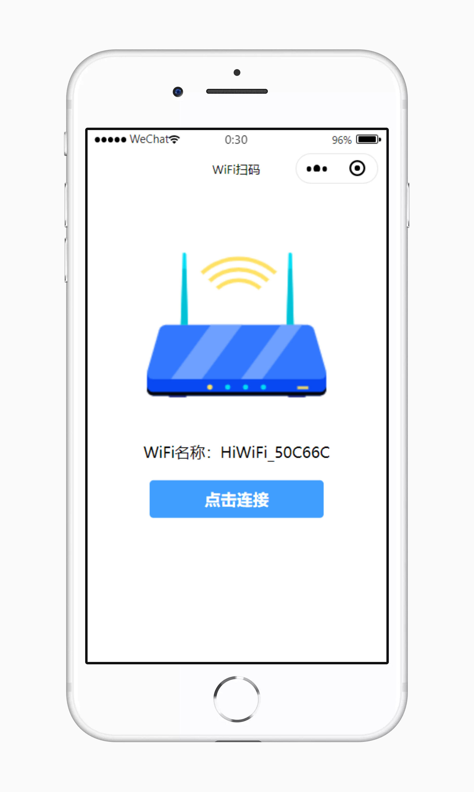
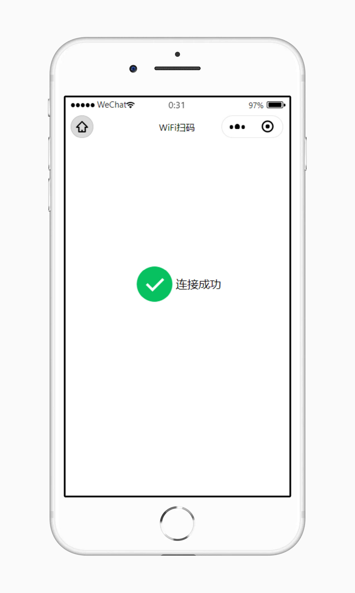
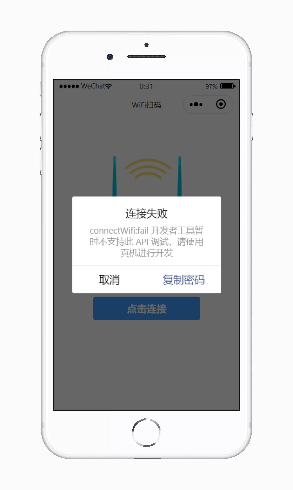
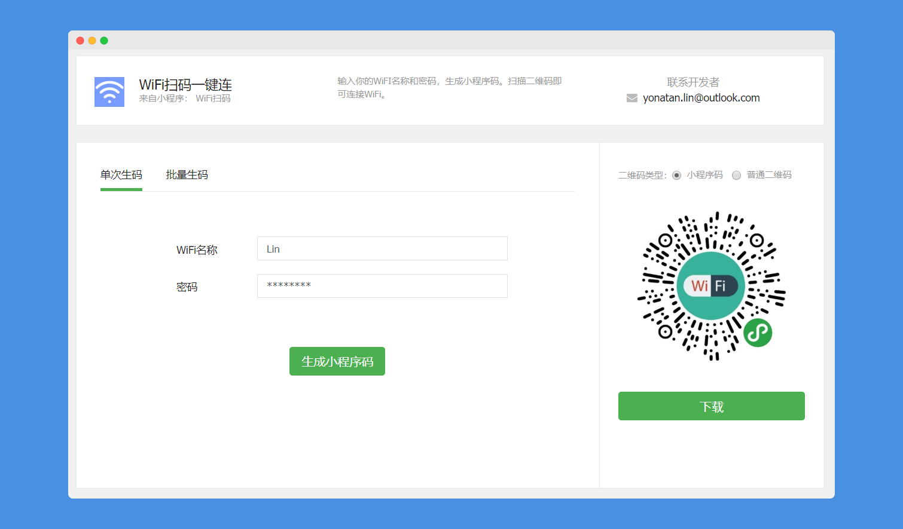

# 扫码一键连接WiFi

本项目使用微信提供的`wx.startWifi`和`wx.connectWifi`加载wifi模块并调用连接方法，使用`wx.setClipboardData`方法获取剪贴板信息。生成二维码直接使用草料（https://cli.im/）的小程序参数二维码生成器制作模板。代码没什么技术含量，仅作为一个Demo提供学习。


## 立即体验
步骤①：访问生码地址（http://cli.im/mina/qrcode/?tpl_id=32859&time=1579661198&publickey=905d59b96599a8471409e9076701cc2a），在页面输入WiFi名称和密码，点击生成小程序码。

步骤②： 使用微信扫一扫，即可打开小程序。


## 截图预览










## 目录结构
```json
|-- wificonnector
    |-- app.js
    |-- app.json
    |-- app.wxss
    |-- project.config.json
    |-- sitemap.json
    |-- images
    |-- pages
    |   |-- connect // 扫码后显示页（主页面）
    |   |-- success // WiFi连接成功页
    |-- utils
```


## 核心代码

```javascript
// pages/connect/connect.js
Page({

  /**
   * 页面的初始数据
   */
  data: {
    ssid: 'WiFi名称',
    bssid: '设备MAC',
    password: '密码'
  },

  /**
   * 生命周期函数--监听页面加载
   */
  onLoad: function (options) {
    let ssid = options.ssid;
    let bssid = options.bssid;
    let password = options.password;
    this.setData({
      ssid: ssid,
      bssid: bssid,
      password: password
    })
  },

  /**
   * 点击连接按钮触发
   */
  connectWifi: function() {
    const that = this;
    wx.showToast({
      title: '请稍等...',
    })
    that.startWiFi();
  },
  
  /**
   * 加载WiFi模块
   */
  startWiFi: function() {
    const that = this;
    wx.startWifi({
      complete: (res) => {
        that.connected();
      },
    })
  },

  /**
   * 连接WiFi
   */
  connected: function() {
    const that = this; 
    wx.connectWifi({
      SSID: that.data.ssid,
      BSSID: that.data.bssid,
      password: that.data.password,
      success: () => {
        wx.showToast({
          title: 'WiFi连接成功',
        })
        // 跳转至成功页面
        wx.redirectTo({
          url: '/pages/success/success',
        })
      },
      fail: (res) => {
        that.errorDialog(res);
      }
    })
  },

  /**
   * 连接失败弹窗
   * @param {错误返回} res 
   */
  errorDialog: function(res) {
    const that = this;
    wx.showModal({
      title: '连接失败',
      content: res.errMsg,
      confirmText: '复制密码',
      success (res) {
        if (res.confirm) {
          that.copyPassword();
        } else if (res.cancel) {
          console.log('cancel')
        }
      },
      fail(res) {
        wx.showToast({
          title: res.errMsg,
        })
      }
    });
  },

  /**
   * 复制密码到剪贴板
   */
  copyPassword: function() {
    const that = this;
    wx.setClipboardData({
      data: that.data.password
    })
  }
})
```
